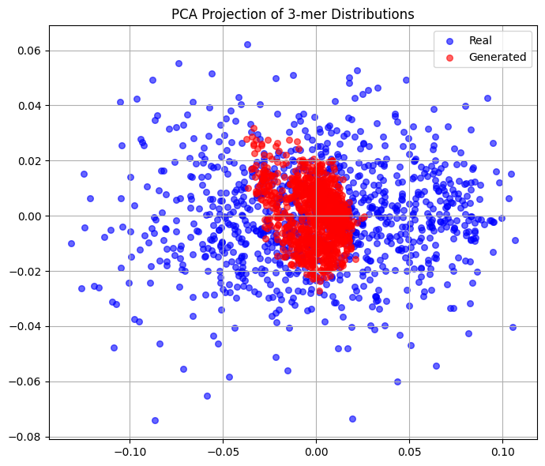
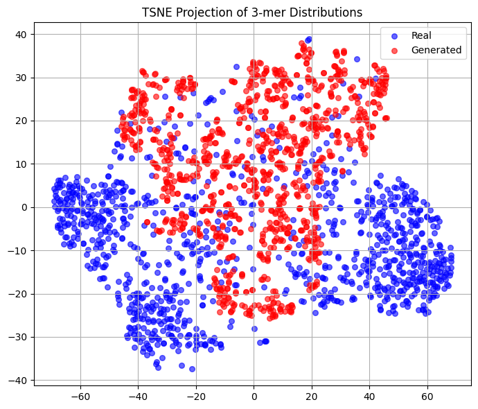
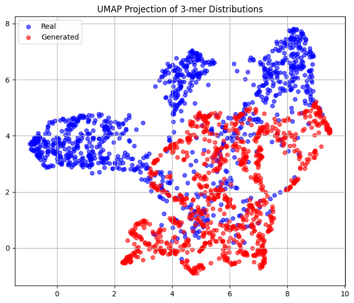
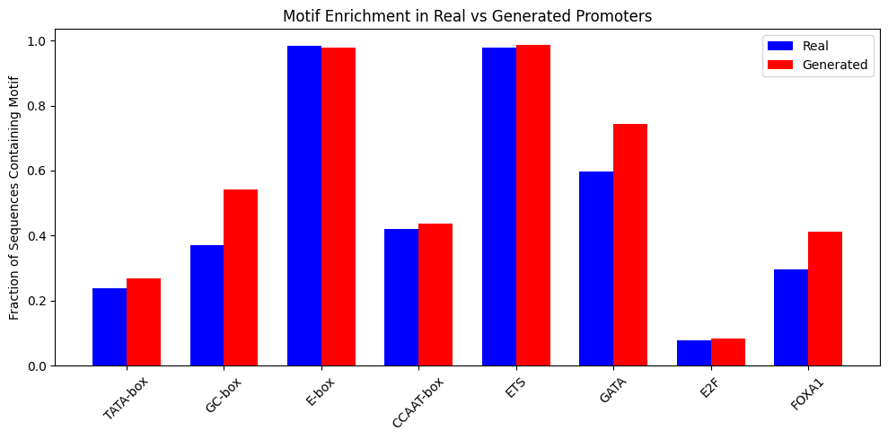

# Cancer Tumor Promoter Generation

Generative modeling of tumor-associated promoter sequences using TCGA-BRCA expression data, human genome promoter extraction, and deep learning sequence models.

This project explores whether neural generative models can learn promoter-like sequence structure from cancer-associated genes and synthesize new regulatory DNA sequences that preserve important biological statistics such as GC content, k-mer composition, and promoter motif enrichment.

## Why This Matters

Promoters regulate gene expression, and dysregulated promoter activity is a central mechanism in cancer biology. Learning the sequence patterns of highly expressed tumor-associated promoters can support:

- in-silico regulatory sequence generation
- promoter motif discovery
- comparison of real and synthetic regulatory DNA
- hypothesis generation for cancer genomics experiments
- expression-aware screening of generated promoter candidates

The project is designed as a computational genomics research workflow: data processing, promoter extraction, model training, generation, scoring, and biological evaluation.

## Project Overview

The core workflow is:

1. Load TCGA-BRCA gene expression data.
2. Rank genes by mean TPM expression across tumor samples.
3. Select the top 1,000 and top 10,000 expressed genes.
4. Extract promoter windows from the hg38 genome.
5. Normalize promoter sequences to fixed-length 1,000 bp inputs.
6. Train generative models on real promoter sequences.
7. Generate synthetic promoter candidates.
8. Evaluate generated promoters against real promoters using sequence statistics, motif enrichment, and expression prediction.

## Methods

### Data Processing

- Expression source: TCGA-BRCA STAR TPM matrix
- Genome reference: hg38
- Gene IDs: Ensembl gene identifiers
- Promoter windows: upstream/downstream regions around transcription start sites
- Final training set: 9,993 normalized 1,000 bp promoter sequences for the top 10,000 expressed genes

### Models Explored

- Residual convolutional VAE for promoter sequence generation
- Residual autoencoder baseline
- Wasserstein GAN with gradient penalty for 1,000 bp promoter generation
- Transformer/attention VAE prototype
- CNN/Basenji-inspired expression predictor for scoring generated sequences

### Evaluation Metrics

- GC content distribution
- k-mer distribution similarity
- Pearson correlation over 3-mer frequencies
- Jensen-Shannon divergence for n-gram distributions
- PCA, t-SNE, and UMAP projections of sequence composition
- Promoter motif enrichment
- Predicted TPM distribution for generated sequences

## Key Results

The strongest results came from the WGAN-based promoter generator trained on the 10,000-gene promoter set.

| Evaluation | Real Promoters | Generated Promoters | Notes |
| --- | ---: | ---: | --- |
| Mean GC content | 0.520 | 0.523 | Generated promoters closely matched real GC content |
| 3-mer Pearson correlation | - | 0.9723 | Strong similarity in local sequence composition |
| 2-mer JS divergence | - | 0.0717 | Lower is better |
| 3-mer JS divergence | - | 0.1111 | Lower is better |
| 4-mer JS divergence | - | 0.1508 | Lower is better |
| Mean TPM, expression model | 3.332 | 3.114 | Generated promoters had similar predicted mean expression |
| TPM standard deviation | 1.991 | 0.202 | Generated expression scores were less diverse than real promoters |
| KS statistic, TPM distribution | - | 0.4429 | Indicates remaining distribution mismatch |
| Wasserstein distance, TPM | - | 1.5068 | Expression distribution still differs from real data |

These results suggest that the WGAN learned strong local sequence structure and promoter-like composition, while expression-level diversity remains an area for improvement.

## Figures

### PCA Projection of 3-mer Distributions

Generated promoters cluster near the center of the real promoter distribution in PCA space, suggesting overlap in broad 3-mer composition.



### t-SNE Projection of 3-mer Distributions

t-SNE reveals partial overlap between real and generated promoter sequence neighborhoods, while also showing that generated sequences occupy a more constrained region of sequence space.



### UMAP Projection of 3-mer Distributions

UMAP shows real and generated promoter sequences forming related but distinct manifolds, highlighting both learned structure and remaining distribution shift.



### Motif Enrichment

Common promoter-associated motifs were compared between real and generated sequences. Generated promoters reproduce several motif-level trends, including strong enrichment for E-box and ETS-like motifs.



## Repository Structure

```text
.
|-- README.md
|-- image.png                         # UMAP projection
|-- output.png                        # t-SNE projection
|-- output1.png                       # Motif enrichment plot
|-- pca.png                           # PCA projection
`-- notebooks/
    |-- TCGA.ipynb                    # Main TCGA preprocessing, promoter extraction, VAE/WGAN modeling
    |-- CNN_train.ipynb               # Expression predictor and generated promoter scoring
    |-- VAE_UCI_Promoter.ipynb        # UCI promoter VAE/AE/Transformer experiments
    |-- VAE_with Attention.ipynb      # Attention-based promoter VAE prototype
    |-- TCSRE.ipynb                   # TCGA helper workflow
    |-- promoter_seq_TPM.csv          # Promoter sequences with expression labels
    |-- wgan_promoters_10000.txt      # Generated WGAN promoter sequences
    |-- wgan_10000_scored_sorted.csv  # Generated promoters scored by predicted TPM
    `-- results/
        `-- generated_promoters.fa
```

## How To Run

Open the notebooks from the `notebooks/` directory and run them in order based on the part of the workflow you want to reproduce:

1. `TCGA.ipynb` for TCGA processing, promoter extraction, and generative modeling.
2. `CNN_train.ipynb` for expression prediction and generated promoter scoring.
3. `VAE_UCI_Promoter.ipynb` for smaller baseline experiments on UCI promoter data.

Recommended Python libraries:

```text
numpy
pandas
scikit-learn
scipy
matplotlib
seaborn
torch
biopython
logomaker
umap-learn
```

External genomics tools used in the promoter extraction workflow:

```text
samtools
bedtools
```

## Notes On Reproducibility

This repository is a research notebook project. Some large model checkpoints are intentionally excluded from version control, and several notebooks were run in an interactive environment. The committed outputs include generated sequences, scored WGAN promoters, processed promoter FASTA files, and summary figures.

For a production-grade version, the next step would be to convert the notebooks into a scripted pipeline with fixed configuration files, environment locking, and checkpoint management.

## Resume Highlights

- Built an end-to-end computational genomics workflow for cancer-associated promoter generation.
- Processed TCGA-BRCA expression data and extracted promoter sequences from hg38.
- Implemented and evaluated VAE, WGAN, transformer, and CNN-based sequence models in PyTorch.
- Generated 10,000 synthetic promoter candidates and scored them with an expression prediction model.
- Evaluated biological realism using GC content, k-mer similarity, motif enrichment, and dimensionality reduction.

## Disclaimer

Generated promoter sequences are in-silico research outputs. They are not experimentally validated regulatory elements and should be interpreted as computational hypotheses.
